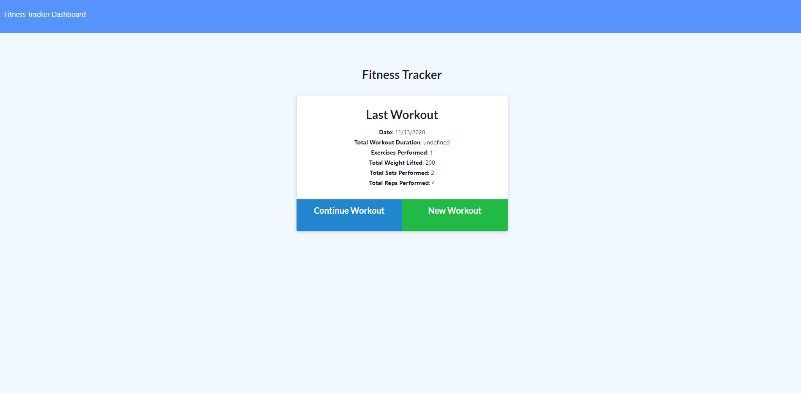

# WorkoutTracker
## Description
This site utlitizes the mongo database to catch and store the user input. Then will return the users last work out on the main page.

## Table of Contents
* [Installation](##Installation)
* [Usage](##Usage)
* [Contributers](##Contributers)
* [License](##License)
* [Tests](##Tests)
* [Questions](##Questions)
## Installation
1. Clone the repo
2. Open Robo 3T
3. In side your terminal run these commands "npm i" and "node seeders/seed.js" this will put data in mongodb so that the site looks complete.
4. Open [localhost:3000](http://localhost:3000/) and enjoy!
## Usage
As a user I can track my workouts in real time. So that I see my progress. The site also has a function to further my workouts if I wanted to abound on my skills.

## License
This project uses the MIT license.
## Contributers
Tyler Morgan, snw380 
## Tests
N/A
## Questions
If you have any questions or suggestions, please contact me here:

 ty.morgan818@gmail.com